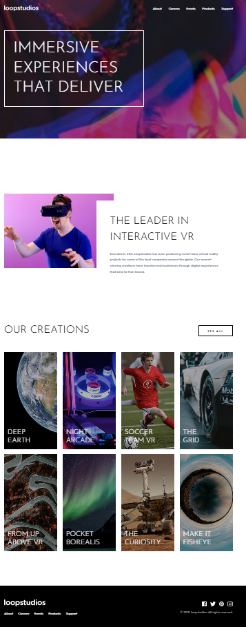

# 🏝️ Proyecto: Loopstudios Landing Page

Este proyecto consiste en el desarrollo de la **landing page de Loopstudios** utilizando **Astro** y **Tailwind CSS**.  
El objetivo es aplicar los conocimientos sobre **componentes de Astro**, **maquetación**, **estilos responsivos** y **utilidades CSS** para construir un diseño limpio, moderno y adaptable a diferentes dispositivos.

---

## 📖 Descripción general

### 🧩 Vista previa del proyecto
Agrega aquí una **captura de pantalla** del resultado final de tu landing page.  

---

### 🔗 Enlaces del proyecto

- **Repositorio en GitHub:** [Agrega aquí la URL de tu repositorio](https://github.com/)
- **Sitio desplegado (opcional):** [Agrega aquí la URL del proyecto desplegado, si usaste Vercel o Netlify](https://)

---

## 🧠 Proceso de desarrollo

### 🛠️ Tecnologías utilizadas
Lista las herramientas y tecnologías que utilizaste en el proyecto. Por ejemplo:

- [Astro](https://astro.build)
- [Tailwind CSS](https://tailwindcss.com/)
- HTML5 semántico
- Diseño responsivo (Mobile-first)
- Componentes de Astro reutilizables
- Interacciones con JavaScript

---

### 💡 Lo que aprendí
Durante el desarrollo de este proyecto reforcé varios conceptos importantes de estructura web y diseño responsivo. Aprendí a estructurar una página utilizando componentes y a organizar mejor el código para mantenerlo limpio y reutilizable.

También practiqué el uso de diseño responsiv0, adaptando el sitio tanto para escritorio como para móvil. Para ello utilicé la etiqueta picture, que permite cargar diferentes imágenes según el tamaño de pantalla:

<picture>
  <source media="(min-width:768px)" srcset="/images/desktop/image-deep-earth.jpg">
  
</picture>

Además reforcé el uso de Flexbox y Grid para crear layouts adaptables, como el grid de 4 columnas en escritorio y una sola columna en móvil para la sección de creaciones.

Otro punto importante fue implementar interactividad con JavaScript, creando un menú hamburguesa para la versión móvil que se abre y cierra al hacer clic:

menuBtn.addEventListener("click", () => {
  mobileMenu.classList.remove("hidden")
})

closeMenu.addEventListener("click", () => {
  mobileMenu.classList.add("hidden")
})

Finalmente, aprendí la importancia de seguir una guía de estilos, respetando tipografías, márgenes y espaciados para lograr un resultado visual consistente con el diseño original.

### 🚀 Áreas de mejora

-Mejorar el manejo del responsivo, especialmente en pantallas móviles.
-Practicar una mejor organización de componentes y estructura del proyecto.
-Implementar animaciones o transiciones para mejorar la experiencia del usuario.
-Practicar el uso de JavaScript para agregar más interactividad.
-Mejorar la organización del código para que sea más limpio y fácil de mantener.
---

### 📚 Recursos útiles

- [Documentación de Astro](https://docs.astro.build)  
- [Guía oficial de Tailwind CSS](https://tailwindcss.com/docs)  
- [MDN Web Docs - HTML y CSS](https://developer.mozilla.org/es/)  
- [Guía de diseño responsivo](https://web.dev/responsive-web-design-basics/)  

---

### 👩‍💻 Autor

- **Nombre completo** Dulce Maria Martinez Vazquez
- **Carrera:**  ITIC'S
- **Grupo:**  11:00-12:00
- **Correo institucional:**  23151245@aguascalientes.tecnm.mx

---

### ✨ Reflexión final

Durante el desarrollo de este proyecto pude practicar la creación de interfaces web a partir de un diseño de referencia. Una de las partes más sencillas fue estructurar el contenido utilizando componentes, mientras que lo más complicado fue ajustar el diseño responsive para que funcionara correctamente tanto en móvil como en escritorio.

La parte que más disfruté fue trabajar en el diseño de las secciones con imágenes y en el menú móvil desplegable. También reforcé conceptos como el uso de Flexbox, Grid y diseño responsive, además de organizar mejor los archivos del proyecto.

En proyectos futuros aplicaré lo aprendido para crear páginas más responsivas, mantener una mejor organización del código y replicar diseños de forma más precisa.

